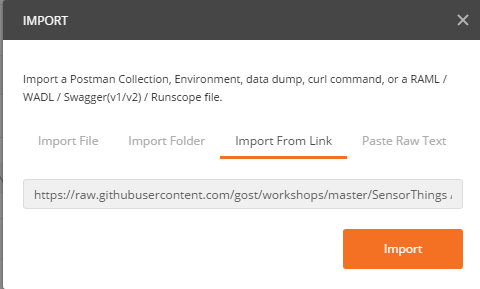
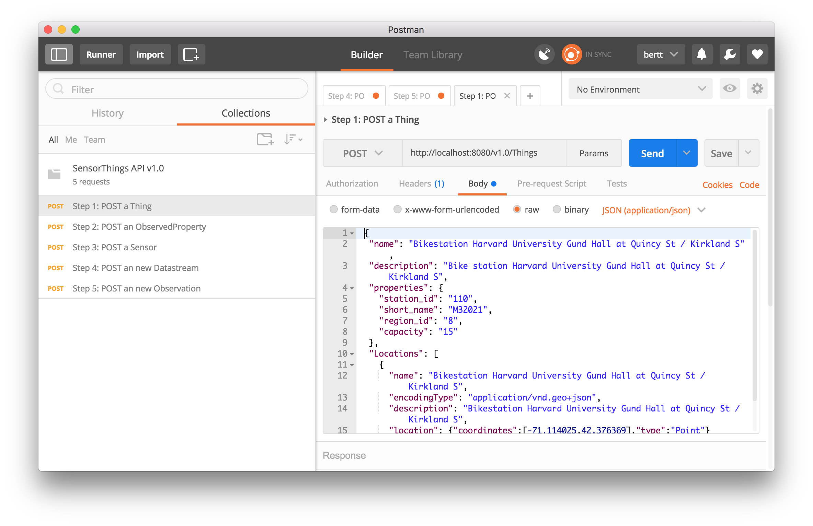

# 3] GOST configuration

## Introduction

Now that GOST is installed let's configure GOST with some metadata about our sensors. In this exercise we'll configure GOST for storing information about the number of available bikes in the bikestation near Harvard University (station_id=110).

## Prerequisites

- Postman

Verify that Postman is installed. If not, download it from https://www.getpostman.com/

If installed, import the file <a href="SensorThings API v1.0.postman_collection.json">SensorThings API v1.0.postman_collection.json</a> from this workshop repository.

In Postman, click the 'Import' button, click Import from link, using url 'https://raw.githubusercontent.com/gost/workshops/master/2017_foss4g_boston/SensorThings%20API%20v1.0.postman_collection.json' and press 'Import'

<kbd></kbd>

After import, Postman should look like:

## Create items

With Postman, we can easily send HTTP requests to the GOST server. On the left panel, select a request ('Step 1: Post a Thing'), on the right panel press 'Body' and Request body text will show up. After hitting 'Send' button the HTTP Response will be showed below the request.  

Use the Postman file to send the following requests, be sure to inspect the request and response to see whats going on. 

- Step 1: Create a Thing with Location

definition Thing: "An object of the physical world (physical things) or the information world (virtual things) that is capable of being identified and integrated into communication networks"

definition Location: "Locates the Thing or the Things it associated with."

- Step 2: Create an ObservedProperty

definition ObservedProperty: "Specifies the phenomenon of an Observation."

- Step 3: Create a Sensor

definition Sensor: "An instrument that observes a property or phenomenon with the goal of producing an estimate of the value of the property."

- Step 4: Create a Datastream 

definition Datastream: " A collection of Observations and the Observations in a Datastream measure the same ObservedProperty and are produced by the same Sensor."

- Step 5: Create an Observation

definition Observation: "Act of measuring or otherwise determining the value of a property"

Note 1: In step 1, 2, 3 make a note of the iot.id created, you'll need these id's in step 4 and 5 to replace 'id_of_the_entity_you_just_created' parameter. The first item created will have number 1 by default, so use that in most cases.

Note 2: In each response you'll see links to related entities, for example posting a Thing will return @iot.selfLink, Locations@iot.navigationLink, Datastreams@iot.navigationLink and HistoricalLocations@iot.navigationLink. Try these links in browser and inspect the response.

## Testing

Open the dashboard http://localhost:8080 and browse through the various entities (Things, ObervedProperties, Sensors, Datastreams, Observations) and check if your data is there.

## Bonus exercise

With the deep insert functions its possible to create multiple entities at once. See <a href="https://github.com/gost/docs/blob/master/gost_deepinsert.md">gost_deepinsert.md</a> for examples. 

Exercise: Try to create a Thing with Location and Datastream (with ObservedProperty and Sensor) in one request.

Continue to <a href = "4_nodered.md">4) GOST and Node-RED</a>

