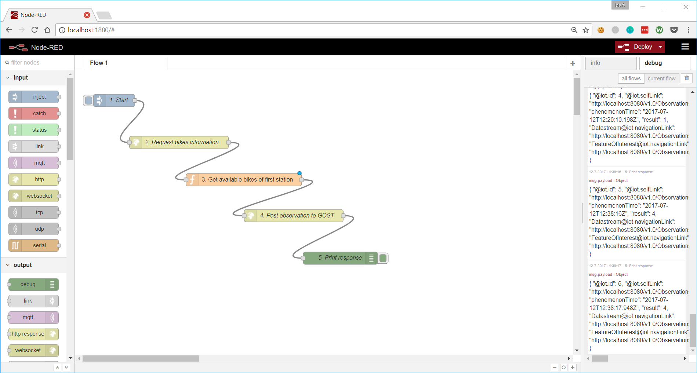
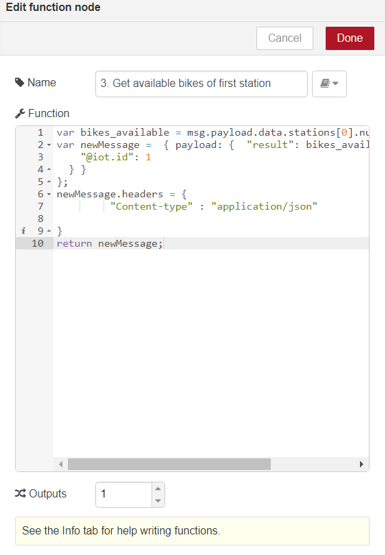
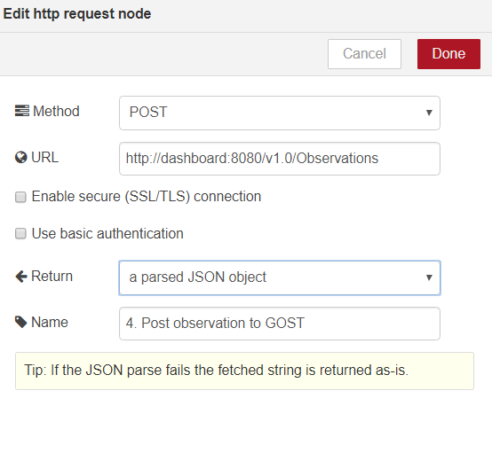

# 4) GOST and Node-RED

<a href="https://nodered.org/">Node-RED</a> is a popular open source visual tool for wiring the Internet of Things. We can use Node-RED to feed data from sensors into GOST or to process GOST data.

Node-RED is also installed in the first exercise and should run on http://localhost:1880 

In this exercise, we'll request an online feed about Boston bike stations (https://gbfs.thehubway.com/gbfs/en/station_status.json). Using Node-RED we'll process the information (get the number of free bikes in a station) and send a new observation to GOST.

The complete flow will look like this:



Now recreate the flow, insert nodes from the left panel, use double-click to edit properties.

Description of the nodes:

1] Start

Type of Node: Input - Inject

Payload type: boolean


2] Request bikes information

Type of Node: Function - http request

Method: GET

URL: https://gbfs.thehubway.com/gbfs/en/station_status.json

Return: A parsed JSON object


3] Get available bikes of first station

Type of Node: Function 

Code: 

```
var bikes_available = msg.payload.data.stations[0].num_bikes_available;
var newMessage =  { payload: {  "result": bikes_available, "Datastream": {
    "@iot.id": 1
  } } 
};
newMessage.headers = {
         "Content-type" : "application/json"
    
}
return newMessage;
```



4] Post observation to GOST

Type of Node: Function - http request

Method: POST

URL: http://dashboard:8080/v1.0/Observations

Return: A parsed JSON object



5] Print response

Type of Node: output - debug


When the model is finished, click the 'Deploy' button (upper right) and run the model by clicking the 1. Start button. Debug information (GOST response after creating new observation) will be shown in the Debug panel (on the right).

If all goes well, new observations are created in GOST. Inspect http://localhost:8080/v1.0/Observations to check it.

Continue to <a href = "5_mqtt.md">5) GOST and MQTT</a>


