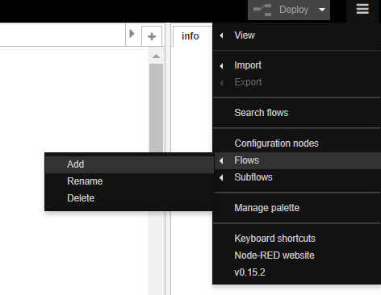
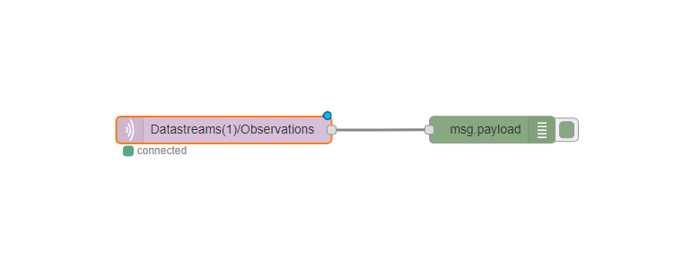
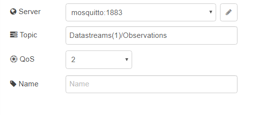
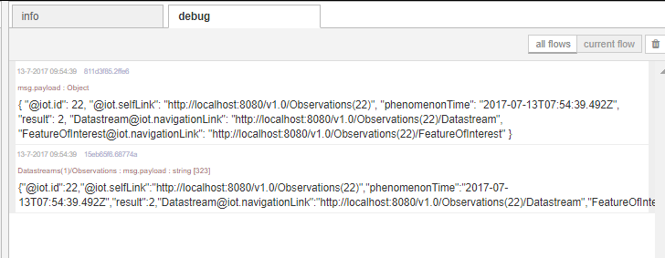
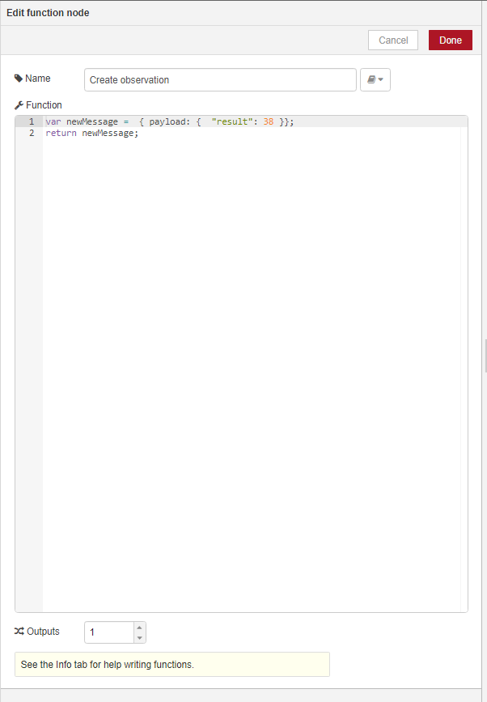
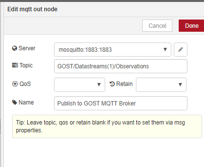

# 5] GOST and MQTT

## Introduction

MQTT (MQ Telemetry Transport or Message Queue Telemetry Transport) is a popular light-weight machine-to-machine protocol based on publish/subscribe mechanism.

In this exercise we'll use Node-RED to publish/subscribe to the GOST MQTT broker.

## Create new flow

Create a new flow in Node-RED using Options (upper right corner)  -> Flows -> Add

## MQTT Subscribe and HTTP POST

First, we subscribe to MQTT messages coming from GOST. We'll use the Node-RED flow from the previous exercise to create a new observation.

The MQTT flow will be very simple:

Description of the Nodes:

1] MQTT

Type of node: Input - MQTT

Server: mosquitto:1883

Topic: Datastreams(1)/Observations

QoS: 2

2] Debug Output

Type of node: Output - debug

If you hit the 'Deploy' button, Node-RED will try to connect to the MQTT broker and display a green button and text 'connected' under the MQTT node if all goes well.

Now run the flow from the previous exercise and inspect the debug panel. 

The debug panel should display two responses with the same information: one from the debug information after running first flow (HTTP Post) and one resulting from the MQTT Subscribe flow.

## MQTT Publish

Its also possible to create an Observation using MQTT.

Extend the MQTT flow with MQTT Publish elements:

Description of the Nodes:

1] Start flow

Type of node: Input - Inject

2] Create observation

Type of node: Function - Function

Function: var newMessage =  { payload: {  "result": 38 }};return newMessage;

3] Publish to GOST MQTT Broker

Type of node: Output - MQTT

Topic: GOST/Datastreams(1)/Observations

Note: The prefix 'GOST' is needed when publishing to let the server know to persist the data.

Deploy the flow and there should be two green connected MQTT nodes: one for publish, one for subscribe.

Now run the Publish to MQTT flow, and inspect the debug output window. There should be 1 observation per each time the publsih flow runs.

Bonus exercise: There are other tools/libraries available for working with MQTT.
Some well known:

- <a href="http://mqttfx.org/">MQTT.fx</a>

- <a href="https://mosquitto.org/">Mosquitto</a>

- <a href="https://eclipse.org/paho/clients/java/">Eclipse Paho Java Client</a>

- <a href="https://eclipse.org/paho/clients/js/">Eclipse Paho Javascript Client</a>

Install some of these tools/frameworks and try to perform the publish/subscribe methods.

Continue to <a href = "6_filtering.md">6) Filtering</a>
