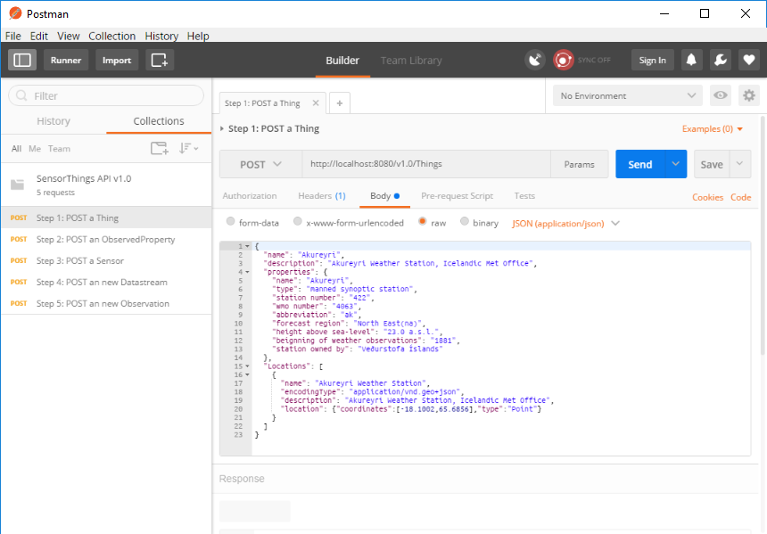

# 2] GOST configuration

## Introduction

Now that GOST is installed let's configure GOST with some metadata about our sensors.

## Prerequisites

- Postman

Verify that Postman is installed. If not, download it from https://www.getpostman.com/

If installed, open the file 'SensorThings API v1.0.postman_collection.json'

After import, Postman should look like:

## Create items

Use the Postman file to send the following requests:

- Step 1: Create a Thing

- Step 2: Create an ObservedProperty

- Step 3: Create a Sensor

- Step 4: Create a Datastream 

- Step 5: Create an Observation

## Testing

Open http://localhost:8080 and browse through the various entities

