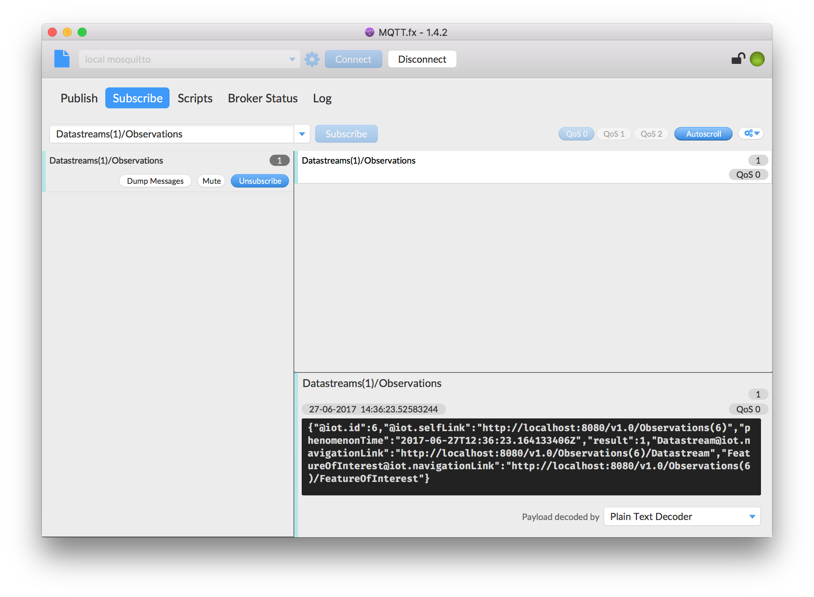
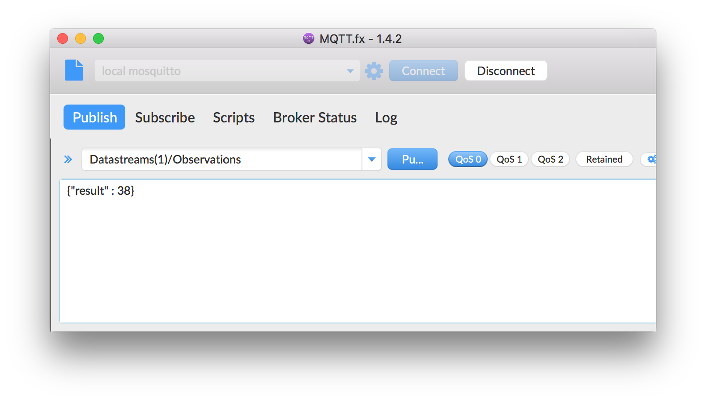

# 3] GOST and MQTT

## Introduction

MQTT (MQ Telemetry Transport or Message Queue Telemetry Transport) is a popular light-weight machine-to-machine protocol based on publish/subscribe mechanism.

In this exercise we'll use the JavaFX based MQTT Client <a href= "http://www.mqttfx.org/">MQTT.fx</a> to explore the usage of GOST and MQTT for publish/subscribe to observations. 

## Install MQTT.fx

Go to <a href= "http://www.mqttfx.org/">MQTT.fx</a> and install MQTT.fx.

## MQTT Subscribe and HTTP POST

First, we subscribe to messages coming from GOST. We'll use Postman to create a new observation just like in the previous
exercise.

Step 1: In MQTT.fx, make a connection to broker on 'localhost'

Step 2: In tab page 'Subscribe', subscribe to topic 'Datastreams(1)/Observations'

Step 3: In Postman, execute step 5 (Create an Observation) from the previous exercise.

On the panel on the right, MQTT.fx should receive the new observation.

## MQTT Subscribe and MQTT Publish

Its also possible to create an Observation using MQTT.

Step 1: In MQTT.fx, make a connection to broker on 'localhost'

Step 2: In tab page 'Subscribe', subscribe to topic 'Datastreams(1)/Observations'

Step 3: In tab page 'Publish', publish to topic 'GOST/Datastreams(1)/Observations'

With the following observation in the body: {"result" : 38}

Hit button 'Publish'

On the panel on the right in the Subscribe page, MQTT.fx should receive the new observation.

Continue to <a href = "4_nodered.md">4) Node-RED</a>
